# **Projeto: SysMap - Bootcamp Salesforce | 7ª Edição**

## 🧠 **Tecnologias utilizadas**

- Salesforce Apex
- Flow Builder

## ⚙️ **Funcionalidades**

- Validação de dados (ex: CNPJ)
- Automação com Flow
- Integração entre Apex e Flow

## 🗂️ **Estrutura do Projeto**

- Apex Classes
- Flows

## 🎯 **Status**

- Finalizado

## 👨‍💻 **Autor**

- Anderson Alves

<br>

___

<br>

### **1º Criação de uma Org especifica para a execução do Projeto.**


<br>

___

<br>

### **2º Criação de Um repositório GitHub com um arquivo Readme.md para a Documentação do projeto e versionamento.**


<br>

___

<br>

### **3º Criação do perfil, configuração de Permissões e Restrição de Acesso.**

- Criação do perfil de Representante de Vendas.

  

- Permissão no Objeto Conta.

  

  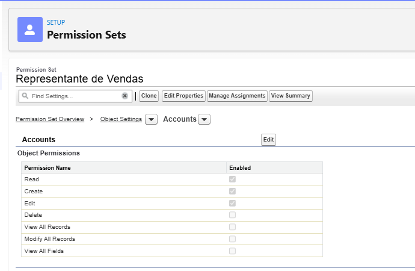  

- Permissão no Objeto Contato.

  

  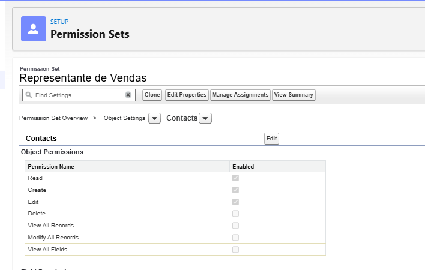

- Restrição de Acesso a objetos desnecessários.

    * Oportuniade

        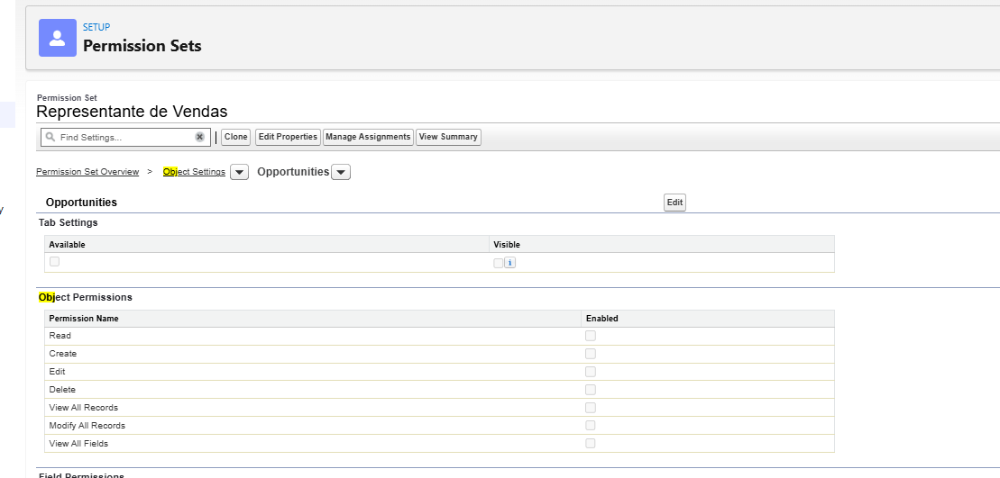

    * Lead

        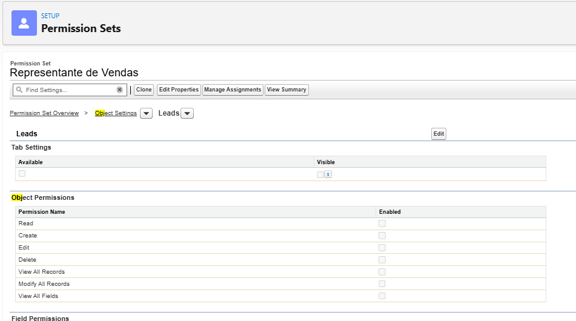

    * Case

        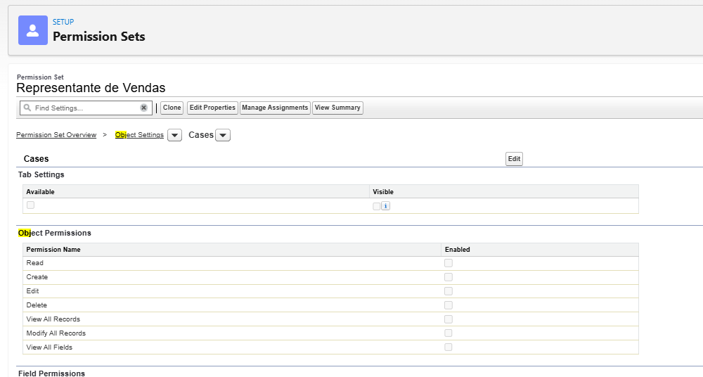

    * Campaign

        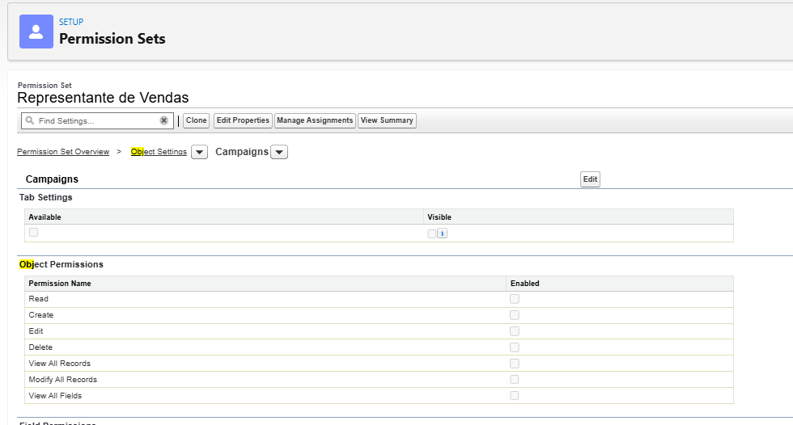

<br>

___

<br>


### **4º Compartilhamento.**

- Sharing Rules

    * Account and contact acesso privado.

        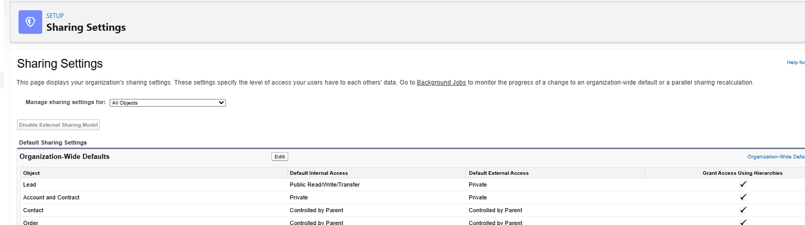

    * Configuração em Account Sharing Rules.

        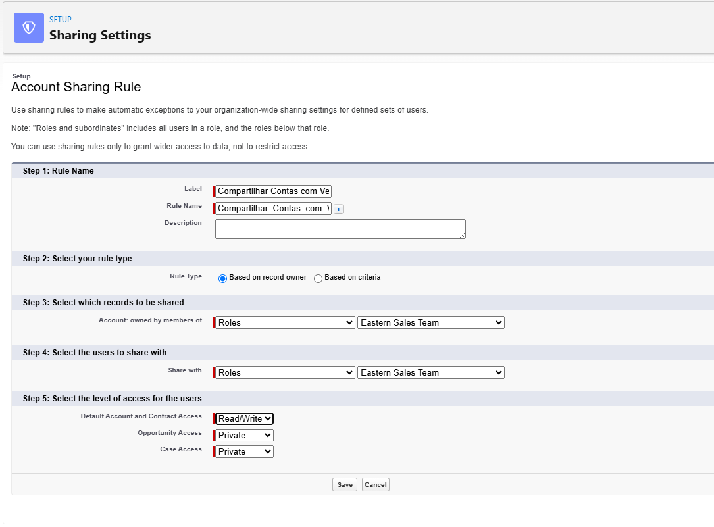

    * Configuração do Role no Usuário Represetante de Vendas.

        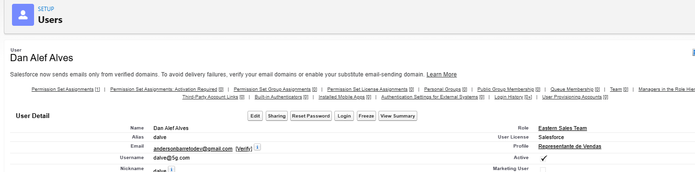

    * Teste de acesso do Representante de Vedas no Flow.

        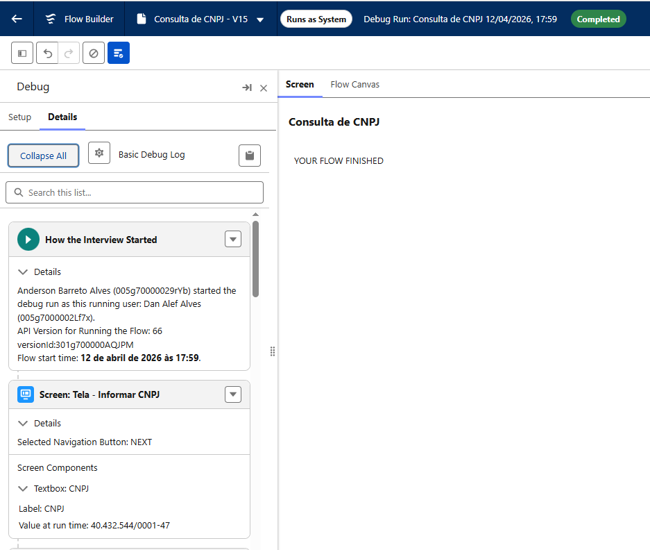

    * Teste de Conta sem acesso usando o Flow.

        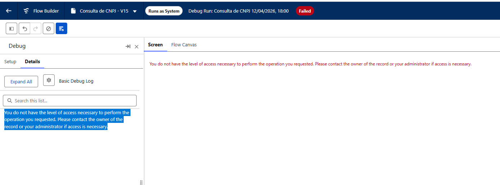


### **5º Liberar API (ReceitaWS)**

- Nome: ReceitaWS
- URL: https://www.receitaws.com.br

  

<br>

___

<br>

### **6º Conexão da IDE com a org e Criação do projeto**

- Sequencia de passoas:

  1- Execute os comentos pelo Terminal (Ctrl + Shift + ").
  - Obs: utilizei o cmd no terminal para a execução dos Comandos
  - Obs: Caso o Comando sfdx não funcionar trocar por sf(sfdx por sf).

  2- sfdx auth:web:login -a andersonbarretodev@resourceful-badger-s0xeok.com
  - comando utilizado para conectar a IDE com a ORG.

  3- sfdx force:project:create -n Projeto-SysMap
  - comando utilizado para criação do projeto na IDE.

  4- sfdx config:set defaultusername=andersonbarretodev@resourceful-badger-s0xeok.com
  - Definir sua org como padrão.

  5- sfdx force:org:list
  - Verificar se o projeto está como Padão.

  

  6- sf org login web --alias andersonbarretodev@resourceful-badger-s0xeok.com --set-default
  - Login já como padrão.

  

  7- sf org open
  - Abrir a Org pela IDE

  <br>

___

<br>

### **7º Criando a Classe Apex**

- Após criar o código, utilizei o Google Gemini para comentá-lo e sugerir melhorias, que foram aplicadas na versão final.

    - Funcionalidades Principais:

        * Saneamento de Dados: Tratamento automático de strings, removendo caracteres especiais e máscaras para garantir que apenas números sejam enviados à API.

        * Validação Prévia: Bloqueio de requisições com CNPJs nulos, com tamanho incorreto ou sequências numéricas inválidas (ex: 000... ou 111...), economizando limites de chamadas.

        * Tratamento de Erros Robusto: * Mapeamento de Status Codes HTTP específicos (429 para limite excedido, 403 para bloqueio, 500 para erro no servidor).

            * Validação de consistência de dados (verifica se o CNPJ retornado é o mesmo solicitado).

            * Captura de erros de status interno do JSON da API.

        * Compatibilidade com Flow: Inclui um método anotado com @InvocableMethod que permite a consultores configurarem a busca de CNPJ diretamente em Fluxos, retornando um objeto estruturado com endereço, telefone e situação cadastral.

        * Segurança: Utiliza a palavra-chave with sharing para respeitar as permissões de compartilhamento de registros do usuário atual.

        <br>


```
/**
 * Classe de serviço para integração com a API ReceitaWS.
 * Permite a consulta de dados de CNPJ para componentes Lightning (LWC/Aura) e Fluxos (Flows).
*/
public with sharing class ReceitaWSService {

    /**
     * @description Realiza a chamada principal para a API da ReceitaWS.
     * @param cnpj String contendo o CNPJ a ser consultado (com ou sem máscara).
     * @return Map<String, Object> contendo os dados retornados pela API.
     * @throws AuraHandledException Exceção tratada para exibição no front-end.
    */
    @AuraEnabled(cacheable=false)
    public static Map<String, Object> buscarCNPJ(String cnpj) {

        // 1. Validação inicial: Verifica se o parâmetro está nulo ou vazio
        if (String.isBlank(cnpj)) {
            throw createAuraException('O CNPJ não pode estar vazio.');
        }

        // 2. Limpeza do dado: Remove caracteres especiais (pontos, barras, traços)
        String cleanCnpj = cnpj.replaceAll('[^0-9]', '');
        
        // 3. Validação de formato: Verifica tamanho e ignora sequências óbvias de teste
        if (cleanCnpj.length() != 14 ||
            cleanCnpj == '00000000000000' ||
            cleanCnpj == '11111111111111') {

            throw createAuraException('CNPJ inválido.');
        }

        // chamada HTTP só ocorre após validações de entrada
        Http http = new Http();
        HttpRequest req = new HttpRequest();
        req.setEndpoint('https://www.receitaws.com.br/v1/cnpj/' + cleanCnpj);
        req.setMethod('GET');
        req.setTimeout(120000);

        try {
            HttpResponse res = http.send(req);

            if (res.getStatusCode() == 429) {
                throw createAuraException('Limite de consultas atingido.');
            }

            if (res.getStatusCode() == 403) {
                throw createAuraException('Acesso bloqueado pela API.');
            }

            if (res.getStatusCode() == 500) {
                throw createAuraException('Erro interno na API.');
            }

            if (res.getStatusCode() != 200) {
                throw createAuraException('Erro ao consultar CNPJ. Tente novamente.');
            }

            // Converte o corpo do JSON (String) em um Mapa de objetos
            Map<String, Object> result =
                (Map<String, Object>) JSON.deserializeUntyped(res.getBody());

            // 5. Verificação de Consistência: Compara se o CNPJ retornado é o mesmo solicitado
            String cnpjRetornado = String.valueOf(result.get('cnpj')).replaceAll('[^0-9]', '');

            if (cnpjRetornado != cleanCnpj) {
                throw createAuraException('Erro: API retornou dados inconsistentes.');
            }

            // 6. Verificação de Erro no JSON: A API pode retornar status 200 mas com erro no corpo
            if (result.get('status') == 'ERROR') {
                throw createAuraException((String) result.get('message'));
            }

            // 7. Verificação de Existência: Garante que dados básicos foram encontrados
            if (result.get('nome') == null) {
                throw createAuraException('CNPJ não encontrado.');
            }

            return result;

        } catch (Exception e) {
            // Captura qualquer erro inesperado e repassa como AuraHandledException
            throw createAuraException(e.getMessage());
        }
    }


    /**
     * @description Método Invocável para ser utilizado em Salesforce Flows (Fluxos).
     * @param inputs Lista de inputs contendo o CNPJ (padrão para InvocableMethod).
     * @return List<RetornoCNPJ> Lista com os dados formatados para o Flow.
     */
    @InvocableMethod(label='Buscar CNPJ')
    public static List<RetornoCNPJ> buscarCNPJFlow(List<InputCNPJ> inputs) {

        List<RetornoCNPJ> lista = new List<RetornoCNPJ>();

        for (InputCNPJ input : inputs) {

            RetornoCNPJ r = new RetornoCNPJ();

            try {
                // Reaproveita a lógica do método principal para obter os dados
                Map<String, Object> result = buscarCNPJ(input.cnpj);

                // Mapeia os campos do Map para as variáveis do objeto de retorno
                r.nome = (String) result.get('nome');
                r.logradouro = (String) result.get('logradouro');
                r.numero = (String) result.get('numero');
                r.complemento = (String) result.get('complemento');
                r.bairro = (String) result.get('bairro');
                r.cidade = (String) result.get('municipio');
                r.uf = (String) result.get('uf');
                r.cep = (String) result.get('cep');
                r.telefone = (String) result.get('telefone');
                
                r.status = (String) result.get('situacao');

                r.erro = false;

            } catch (Exception e) {
                // Caso ocorra erro, sinaliza ao Flow e envia a mensagem de erro
                r.erro = true;
                r.mensagemErro = e.getMessage();
            }

            lista.add(r);
        }

        return lista;
    }

    /**
     * @description Classe Wrapper para entrada de dados no Flow.
     */
    public class InputCNPJ {
        @InvocableVariable(required=true)
        public String cnpj;
    }

    /**
     * @description Classe Wrapper para saída de dados no Flow.
     */
    public class RetornoCNPJ {

        @InvocableVariable
        public String nome;

        @InvocableVariable
        public String logradouro;

        @InvocableVariable
        public String numero;

        @InvocableVariable
        public String complemento;

        @InvocableVariable
        public String bairro;

        @InvocableVariable
        public String cidade;

        @InvocableVariable
        public String uf;

        @InvocableVariable
        public String cep;

        @InvocableVariable
        public String telefone;

        @InvocableVariable
        public String status;

        @InvocableVariable
        public Boolean erro;

        @InvocableVariable
        public String mensagemErro;
    }

    /**
     * @description Método auxiliar para criar exceções que podem ser lidas pelo Lightning.
     * @param Mensagem de erro amigável.
     * @return AuraHandledException
     */
    private static AuraHandledException createAuraException(String message) {
        AuraHandledException e = new AuraHandledException(message);
        e.setMessage(message);
        return e;
    }
}
```

<br>

___

<br>

### **8º Criação da Classe de teste.**

* A Cobertura da Classe de teste ficou em 88%, onde solicitei ao Google Gemini a melhoria da mesma para retornar 100%.

    * A classe de teste foi desenvolvida para garantir a estabilidade do código e atingir 100% de cobertura, simulando todos os cenários possíveis sem depender de uma conexão real com a internet.

    * Estratégia de Teste:
        *Mock Dinâmico: Implementação da interface HttpCalloutMock que permite simular diferentes respostas da API (sucesso, erro 404, erro 500, etc.) dentro de uma única classe auxiliar.

    * Cenários Cobertos:

        * Sucesso Ponta a Ponta: Validação do mapeamento correto de todos os campos (Nome, Logradouro, Bairro, Município, UF, etc.).

        * Falhas de Entrada: Testes com CNPJ vazio, curto demais ou com padrões inválidos.

        * Indisponibilidade da API: Simulação de limites atingidos e erros internos do servidor externo.

        * Inconsistência de Dados: Teste de segurança para garantir que o sistema detecte se a API retornar um CNPJ diferente do requisitado.

        * Integração com Flow: Teste específico para garantir que as variáveis de entrada e saída dos Fluxos estão funcionando conforme o esperado.

    <br>

```
/**
 * @description Classe de teste para ReceitaWSService.
 * Garante que todas as validações de CNPJ, retornos de API e lógica de Flow funcionem corretamente.
 */
@isTest
private class ReceitaWSServiceTest {

    /**
     * @description Classe interna que implementa HttpCalloutMock.
     * Permite simular respostas da API sem fazer uma chamada real à internet (obrigatório em testes Apex).
     */
    private class ReceitaWSDynamicMock implements HttpCalloutMock {
        private Integer statusCode;
        private String responseBody;

        // O construtor permite definir dinamicamente o status (200, 404, etc) e o JSON de retorno
        public ReceitaWSDynamicMock(Integer statusCode, String responseBody) {
            this.statusCode = statusCode;
            this.responseBody = responseBody;
        }

        public HttpResponse respond(HttpRequest req) {
            HttpResponse res = new HttpResponse();
            res.setHeader('Content-Type', 'application/json');
            res.setBody(this.responseBody);
            res.setStatusCode(this.statusCode);
            return res;
        }
    }
    
    // --- TESTES DE VALIDAÇÃO DE REGRA DE NEGÓCIO (ANTES DA CHAMADA API) ---

    @isTest
    static void testCnpjVazio() {
        try {
            ReceitaWSService.buscarCNPJ('');
            System.assert(false, 'Deveria ter falhado por CNPJ vazio');
        } catch (Exception e) {
            // Verifica se a mensagem de erro retornada é a esperada
            System.assert(e.getMessage().contains('O CNPJ não pode estar vazio.'));
        }
    }

    @isTest
    static void testCnpjTamanhoInvalido() {
        try {
            ReceitaWSService.buscarCNPJ('123456'); // CNPJ com menos de 14 dígitos
            System.assert(false, 'Deveria ter falhado pelo tamanho do CNPJ');
        } catch (Exception e) {
            System.assert(e.getMessage().contains('CNPJ inválido.'));
        }
    }

    @isTest
    static void testCnpjApenasZeros() {
        try {
            ReceitaWSService.buscarCNPJ('00000000000000'); // Bloqueia sequências inválidas conhecidas
            System.assert(false, 'Deveria ter falhado por conter apenas zeros');
        } catch (Exception e) {
            System.assert(e.getMessage().contains('CNPJ inválido.'));
        }
    }

    @isTest
    static void testCnpjApenasUns() {
        try {
            ReceitaWSService.buscarCNPJ('11111111111111');
            System.assert(false, 'Deveria ter falhado por conter apenas uns');
        } catch (Exception e) {
            System.assert(e.getMessage().contains('CNPJ inválido.'));
        }
    }

    // --- TESTES DE ERROS DE STATUS HTTP (RESPOSTAS DO SERVIDOR) ---

    @isTest
    static void testErro429LimiteConsultas() {
        // Simula o erro 429 (Too Many Requests) da ReceitaWS
        Test.setMock(HttpCalloutMock.class, new ReceitaWSDynamicMock(429, '{}'));
        try {
            Test.startTest();
            ReceitaWSService.buscarCNPJ('00000000000191');
            Test.stopTest();
        } catch (Exception e) {
            System.assert(e.getMessage().contains('Limite de consultas atingido.'));
        }
    }

    @isTest
    static void testErro403AcessoBloqueado() {
        // Simula erro de permissão ou bloqueio de IP
        Test.setMock(HttpCalloutMock.class, new ReceitaWSDynamicMock(403, '{}'));
        try {
            Test.startTest();
            ReceitaWSService.buscarCNPJ('00000000000191');
            Test.stopTest();
        } catch (Exception e) {
            System.assert(e.getMessage().contains('Acesso bloqueado pela API.'));
        }
    }

    @isTest
    static void testErro500InternoAPI() {
        // Simula erro de servidor na ReceitaWS
        Test.setMock(HttpCalloutMock.class, new ReceitaWSDynamicMock(500, '{}'));
        try {
            Test.startTest();
            ReceitaWSService.buscarCNPJ('00000000000191');
            Test.stopTest();
        } catch (Exception e) {
            System.assert(e.getMessage().contains('Erro interno na API.'));
        }
    }

    @isTest
    static void testErroOutroStatusNao200() {
        // Simula qualquer outro erro HTTP (ex: 404 Not Found)
        Test.setMock(HttpCalloutMock.class, new ReceitaWSDynamicMock(404, '{}'));
        try {
            Test.startTest();
            ReceitaWSService.buscarCNPJ('00000000000191');
            Test.stopTest();
        } catch (Exception e) {
            System.assert(e.getMessage().contains('Erro ao consultar CNPJ. Tente novamente.'));
        }
    }

    // --- TESTES DE VALIDAÇÃO DE CONTEÚDO (DENTRO DO JSON RETORNADO) ---

    @isTest
    static void testCnpjInconsistente() {
        // Simula cenário onde a API retorna um CNPJ diferente do que foi enviado (erro de integridade)
        String jsonRetorno = '{"cnpj": "99.999.999/9999-99"}';
        Test.setMock(HttpCalloutMock.class, new ReceitaWSDynamicMock(200, jsonRetorno));
        
        try {
            Test.startTest();
            ReceitaWSService.buscarCNPJ('00.000.000/0001-91');
            Test.stopTest();
        } catch (Exception e) {
            System.assert(e.getMessage().contains('dados inconsistentes'));
        }
    }

    @isTest
    static void testStatusErrorNoJson() {
        // Simula cenário onde o HTTP é 200, mas o JSON traz um erro da própria ReceitaWS
        String jsonRetorno = '{"cnpj": "00.000.000/0001-91", "status": "ERROR", "message": "CNPJ Rejeitado"}';
        Test.setMock(HttpCalloutMock.class, new ReceitaWSDynamicMock(200, jsonRetorno));
        
        try {
            Test.startTest();
            ReceitaWSService.buscarCNPJ('00.000.000/0001-91');
            Test.stopTest();
        } catch (Exception e) {
            System.assert(e.getMessage().contains('CNPJ Rejeitado'));
        }
    }

    @isTest
    static void testNomeNulo() {
        // Testa se o sistema trata CNPJs que não existem (API retorna OK, mas sem o campo 'nome')
        String jsonRetorno = '{"cnpj": "00.000.000/0001-91", "status": "OK"}';
        Test.setMock(HttpCalloutMock.class, new ReceitaWSDynamicMock(200, jsonRetorno));
        
        try {
            Test.startTest();
            ReceitaWSService.buscarCNPJ('00.000.000/0001-91');
            Test.stopTest();
        } catch (Exception e) {
            System.assert(e.getMessage().contains('CNPJ não encontrado.'));
        }
    }

    @isTest
    static void testExceptionGenericaCatch() {
        // Força um erro de processamento (JSON mal formado) para cobrir as linhas do bloco catch(Exception e)
        Test.setMock(HttpCalloutMock.class, new ReceitaWSDynamicMock(200, 'JSON_QUEBRADO {'));
        try {
            Test.startTest();
            ReceitaWSService.buscarCNPJ('00000000000191');
            Test.stopTest();
        } catch (Exception e) {
            // Garante que a exceção foi capturada e tratada
            System.assert(e != null, 'Deve cair no catch genérico');
        }
    }

    // --- TESTES DE SUCESSO E COMPATIBILIDADE COM FLOW ---

    @isTest
    static void testFlowCnpjSucesso() {
        // Testa o cenário perfeito: API retorna 200 e todos os campos preenchidos
        String jsonRetorno = '{"cnpj": "00.000.000/0001-91", "status": "OK", "nome": "EMPRESA SUCESSO", "logradouro": "RUA A", "numero": "123", "complemento": "SALA 1", "bairro": "CENTRO", "municipio": "SAO PAULO", "uf": "SP", "cep": "01000-000", "telefone": "1199999999", "situacao": "ATIVA"}';
        Test.setMock(HttpCalloutMock.class, new ReceitaWSDynamicMock(200, jsonRetorno));
        
        ReceitaWSService.InputCNPJ input = new ReceitaWSService.InputCNPJ();
        input.cnpj = '00000000000191';
        
        Test.startTest();
        // Chama o método específico para Flows
        List<ReceitaWSService.RetornoCNPJ> retornos = ReceitaWSService.buscarCNPJFlow(new List<ReceitaWSService.InputCNPJ>{ input });
        Test.stopTest();
        
        // Asserções para garantir que os dados mapeados para o Flow estão corretos
        System.assertEquals(1, retornos.size(), 'Deve retornar 1 registro');
        System.assertEquals(false, retornos[0].erro, 'Não deve conter erro');
        System.assertEquals('EMPRESA SUCESSO', retornos[0].nome);
        System.assertEquals('ATIVA', retornos[0].status);
    }

    @isTest
    static void testFlowCnpjErro() {
        // Testa se o Flow recebe corretamente a flag de erro quando um CNPJ inválido é passado
        ReceitaWSService.InputCNPJ input = new ReceitaWSService.InputCNPJ();
        input.cnpj = '123'; // CNPJ inválido
        
        Test.startTest();
        List<ReceitaWSService.RetornoCNPJ> retornos = ReceitaWSService.buscarCNPJFlow(new List<ReceitaWSService.InputCNPJ>{ input });
        Test.stopTest();
        
        System.assertEquals(1, retornos.size());
        System.assertEquals(true, retornos[0].erro, 'O erro deve ser true');
        System.assert(retornos[0].mensagemErro.contains('CNPJ inválido.'), 'A mensagem de erro deve ser repassada ao Flow');
    }
}
```

<br>

___

<br>

### **9º Execução do teste no Developer Console.**

* Execução do teste 100%.

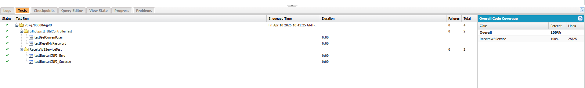

### **10º Criação do Flow.**
   
* Tela do Flow:

    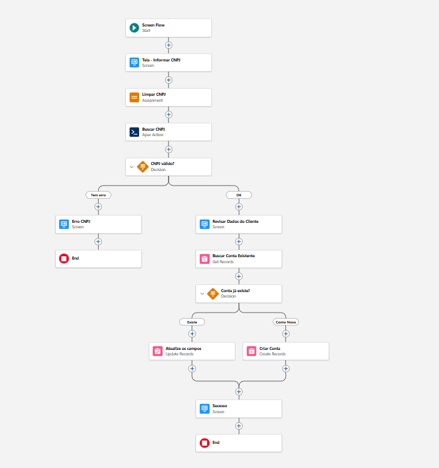

    <br>

* Screen - Informar CNPJ:

    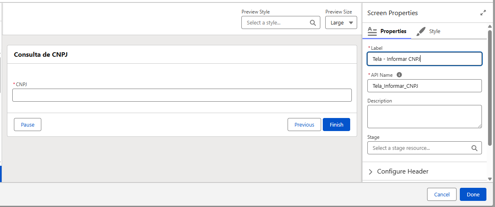

    <br>

* Assignment - Limpar CNPJ:

     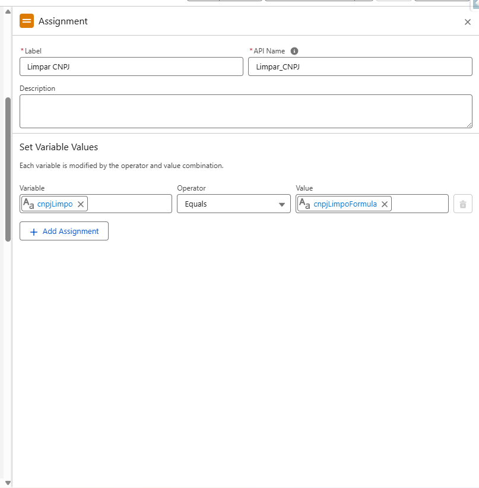

    <br>

* Tela Action - Buscar CNPJ:

    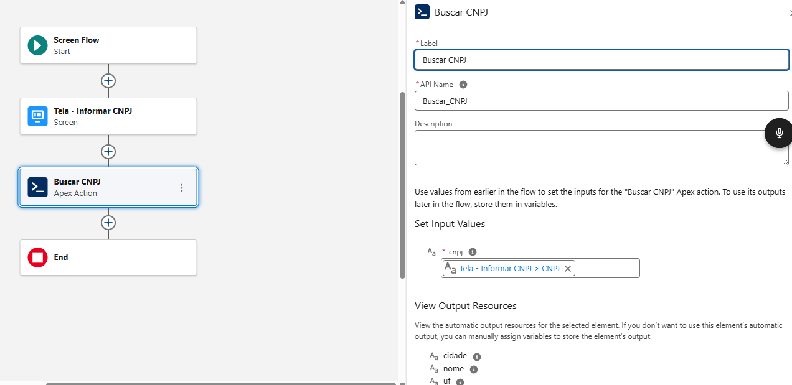

    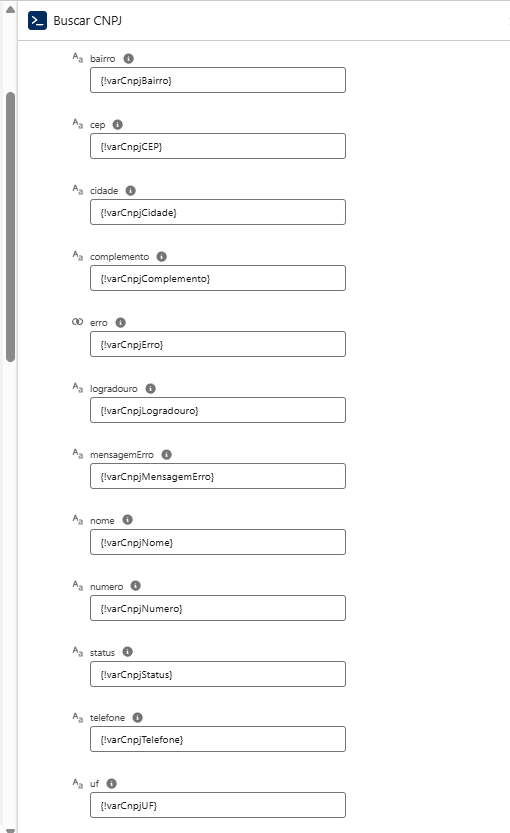

    <br>

* Decision - CNPJ válido?:

    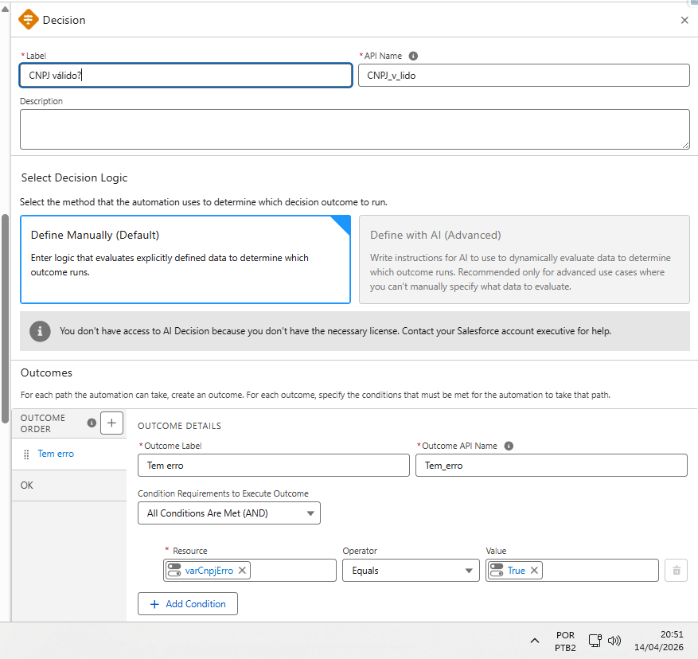

    <br>

    * Tem Erro:
        * Screen - Erro CNPJ:

            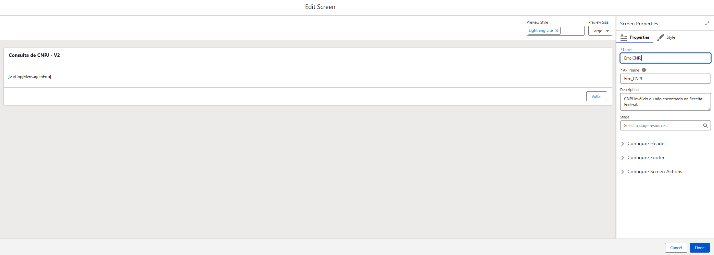

            <br>

    * OK:
        * Screen - Revisar Dados Cliente:

            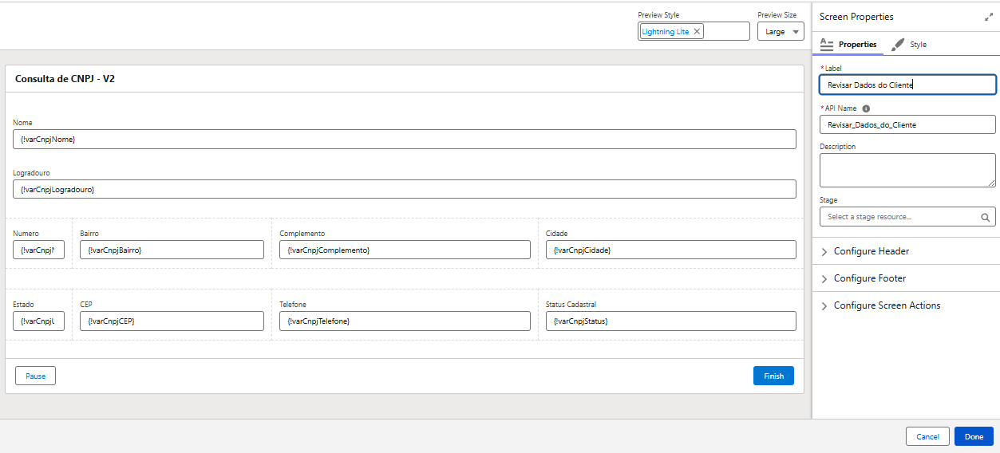

            <br>

        * Get Records - Buscar Conta Existente:

            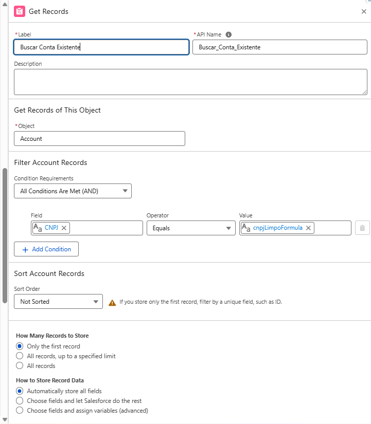

            <br>

        * Decision - Conta já existe?:

            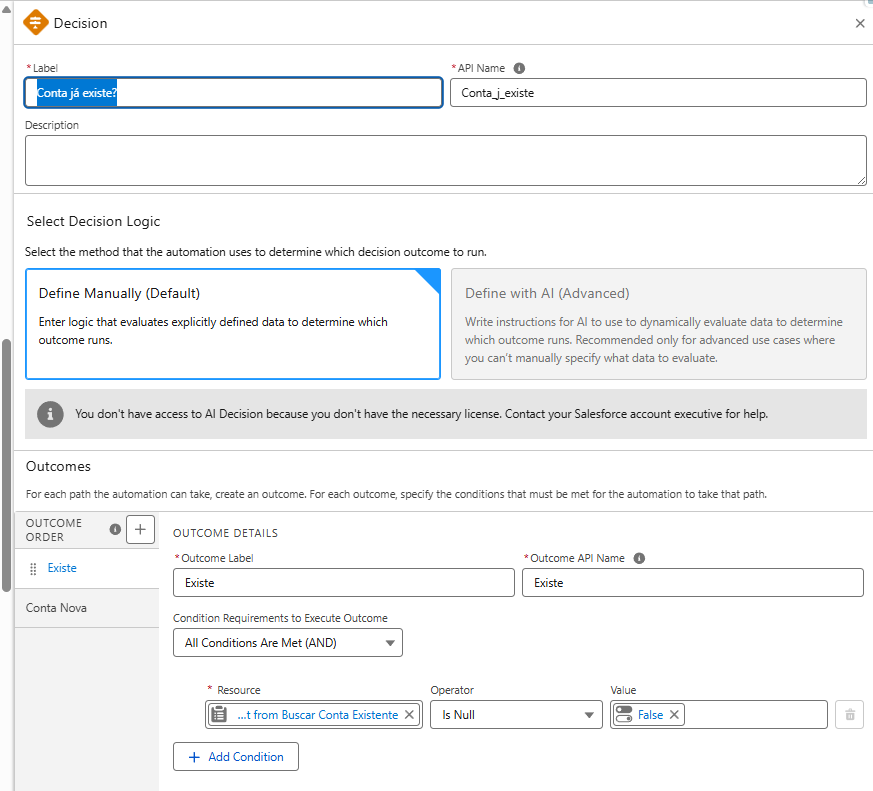

            <br>

            * Existe:
                * Update Records - AAtualize os campos:

                    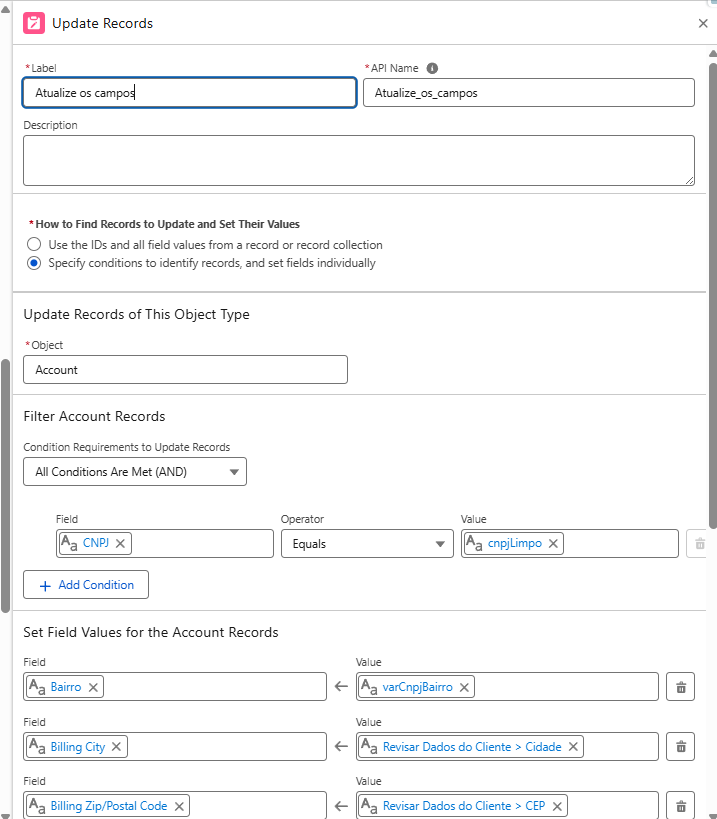

                    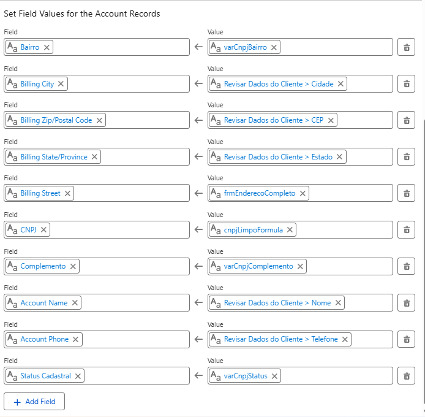

                    <br>

            * Conta Nova:
                * Create Records - Criar Conta:

                    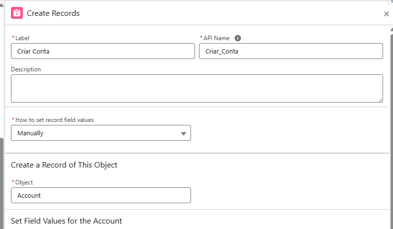

                    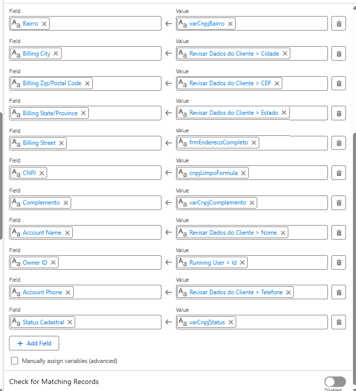

                    <br>

        * Screen - Sucesso:

            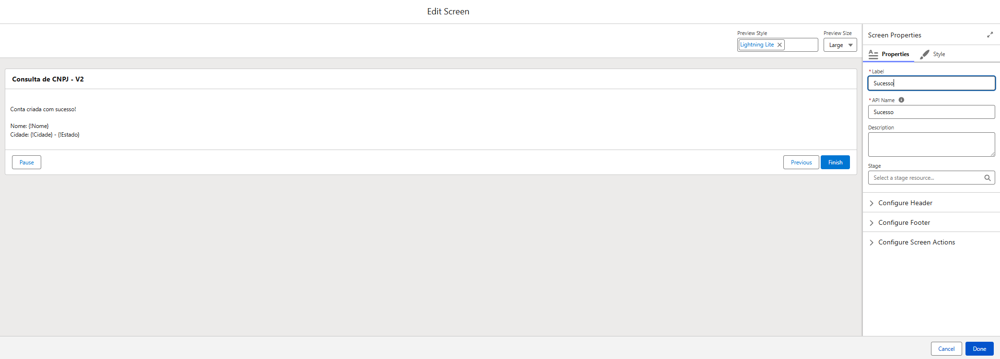

<br>

___

<br


### **Link do Víde de apresentação do Projeto**

https://www.youtube.com/watch?v=350bOoCkuEc

# 🎥 Link do Vídeo de Apresentação do Projeto

[](https://www.youtube.com/watch?v=350bOoCkuEc)


            


