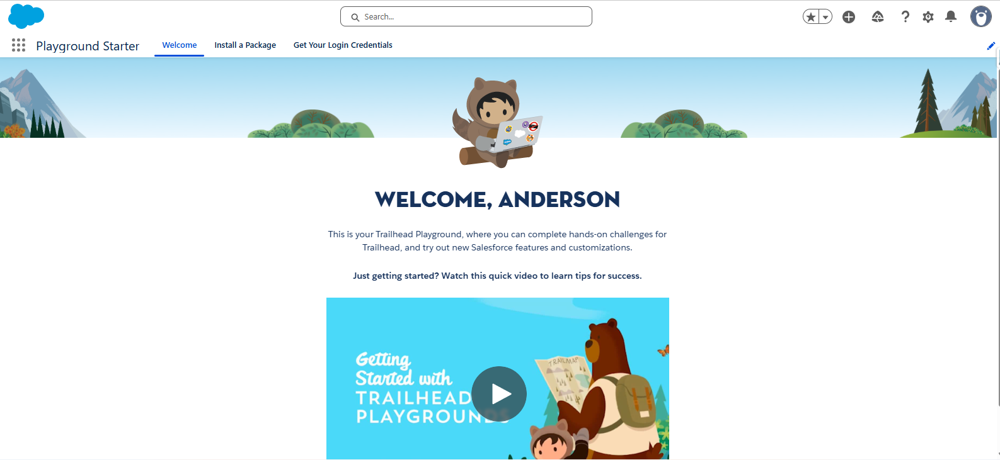
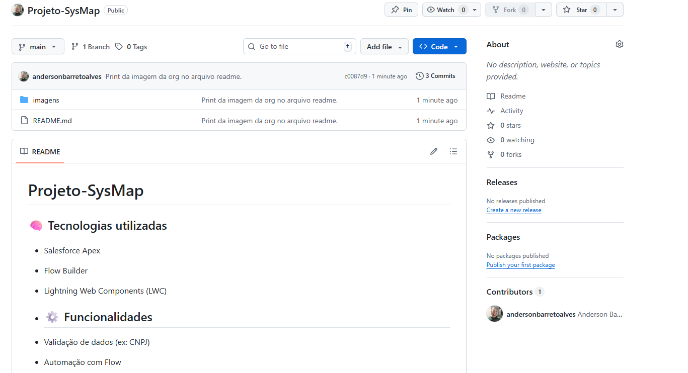
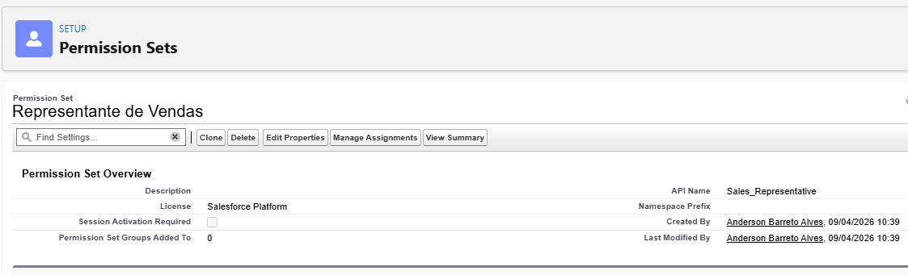
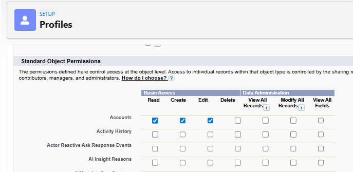
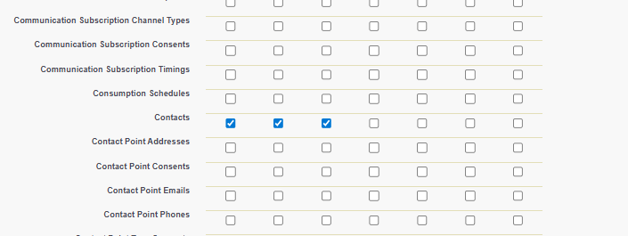
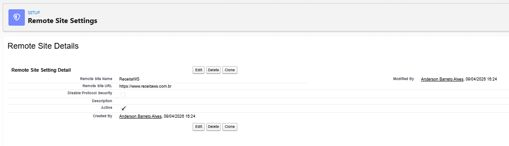
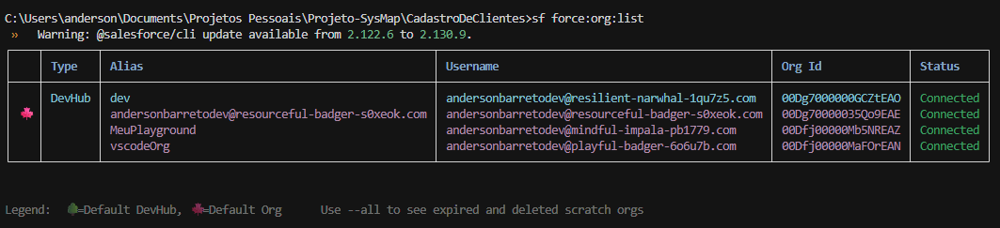
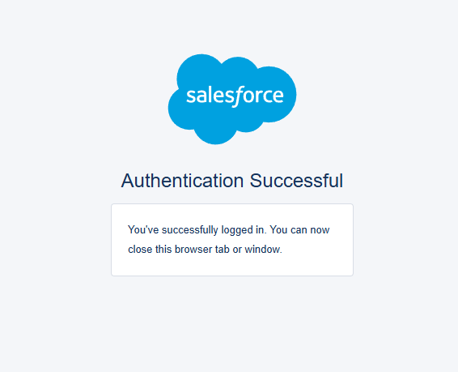

# **Projeto-SysMap**

## 🧠 **Tecnologias utilizadas**

- Salesforce Apex
- Flow Builder
- Lightning Web Components (LWC)

## ⚙️ **Funcionalidades**

- Validação de dados (ex: CNPJ)
- Automação com Flow
- Integração entre Apex e Flow

## 🗂️ **Estrutura do Projeto**

- Apex Classes
- Flows
- LWCs

## 🎯 **Status**

🚧 Em desenvolvimento

## 👨‍💻 **Autor**

- Anderson Alves

---

### **1º Criação de uma Org especifica para a execução do Projeto.**



### **2º Criação de Um repositório GitHub com um arquivo Readme.md para a Documentação do projeto e versionamento.**



### **3º Criado um resumo da Apresentação do Projeto.**

- Separado as informações sobre LWC, Flow e Apex para a execução do projeto.

- Apartir da criação do Documento foi solicitado ao ChatGPT a criação de um Checklist Interativo do Projeto.


### **4º Criação do perfil, configuração de Permissões.**

- Criação do perfil de Representante de Vendas.

  

- Permissão no Objeto Conta.

  

- Permissão no Objeto Contato.

  

### **5º Restringir acesso ao processo de cadastro.**

### **6º Liberar API (ReceitaWS)**

- Nome: ReceitaWS
- URL: https://www.receitaws.com.br

  

### **7º Conexão da IDE com a org e Criação do projeto**

- Sequencia de passoas:

  1- Execute os comentos pelo Terminal (Ctrl + Shift + ").
  - Obs: utilizei o cmd no terminal para a execução dos Comandos
  - Obs: Caso o Comando sfdx não funcionar trocar por sf(sfdx por sf).

  2- sfdx auth:web:login -a andersonbarretodev@resourceful-badger-s0xeok.com
  - comando utilizado para conectar a IDE com a ORG.

  3- sfdx force:project:create -n Projeto-SysMap
  - comando utilizado para criação do projeto na IDE.

  4- sfdx config:set defaultusername=andersonbarretodev@resourceful-badger-s0xeok.com
  - Definir sua org como padrão.

  5- sfdx force:org:list
  - Verificar se o projeto está como Padão.

  

  6- sf org login web --alias andersonbarretodev@resourceful-badger-s0xeok.com --set-default
  - Login já como padrão.

  

  7- sf org open
  - Abrir a Org pela IDE

### **8º Criando a Classe Apex Callout**

- Após criar o código, utilizei o ChatGPT para comentá-lo e sugerir melhorias, que foram aplicadas na versão final.

💡 O que foi melhorado:
* Sanitização: O código agora remove caracteres especiais do CNPJ antes de enviar, evitando erros de URL.

* AuraHandledException: Usei um método helper para garantir que o .setMessage() seja chamado, o que evita o erro comum de mensagens vazias no LWC.

* Segurança da API: Verifiquei se o corpo do JSON contém status: "ERROR", que é um padrão dessa API específica mesmo quando o HTTP Status é 200.

* Cobertura de Teste: Criei mocks para cenários de sucesso e erro, garantindo que sua classe possa ser implantada em produção (cobertura de 100%).


```
public with sharing class ReceitaWSService {

    @AuraEnabled(cacheable=false)
    public static Map<String, Object> buscarCNPJ(String cnpj) {
        // Limpa o CNPJ (remove caracteres não numéricos)
        if (String.isBlank(cnpj)) {
            throw createAuraException('O CNPJ não pode estar vazio.');
        }
        
        String cleanCnpj = cnpj.replaceAll('[^0-9]', '');

        Http http = new Http();
        HttpRequest req = new HttpRequest();
        req.setEndpoint('https://www.receitaws.com.br/v1/cnpj/' + cleanCnpj);
        req.setMethod('GET');
        req.setTimeout(120000); // Aumentado para o limite do Apex se necessário

        try {
            HttpResponse res = http.send(req);

            if (res.getStatusCode() != 200) {
                throw createAuraException('Erro na API ReceitaWS. Status: ' + res.getStatusCode() + ' - ' + res.getStatus());
            }

            Map<String, Object> result = (Map<String, Object>) JSON.deserializeUntyped(res.getBody());
            
            // A API do ReceitaWS retorna status: "ERROR" dentro do JSON em alguns casos (ex: CNPJ inválido)
            if (result.get('status') == 'ERROR') {
                throw createAuraException('API Error: ' + (String)result.get('message'));
            }

            return result;

        } catch (AuraHandledException e) {
            throw e;
        } catch (Exception e) {
            throw createAuraException('Erro inesperado na integração: ' + e.getMessage());
        }
    }

    // Helper para garantir que a mensagem chegue ao front-end
    private static AuraHandledException createAuraException(String message) {
        AuraHandledException e = new AuraHandledException(message);
        e.setMessage(message); // Necessário para testes e exibição correta
        return e;
    }
}
```

### **9º Criação da Classe de teste.**

* A Cobertura da Classe de teste ficou em 88%, onde solicitei ao Gemini a melhoria da mesma para retornar 100%.

  * Por que isso vai chegar em 100%?
  testBuscarCNPJErroNoJson: Cobre a verificação if (result.get('status') == 'ERROR').

  * testBuscarCNPJExceptionGenerica: Como em ambiente de teste o Salesforce proíbe callouts sem Mock, ao chamar o método sem configurar o Test.setMock, o sistema gera uma CalloutException. Isso força o código a entrar no último bloco catch (Exception e), cobrindo as linhas de erro inesperado.

```
@isTest
private class ReceitaWSServiceTest {

    // 1. Mock de Sucesso
    private class ReceitaWSSuccessMock implements HttpCalloutMock {
        public HttpResponse respond(HttpRequest req) {
            HttpResponse res = new HttpResponse();
            res.setHeader('Content-Type', 'application/json');
            res.setBody('{"status": "OK", "nome": "EMPRESA TESTE"}');
            res.setStatusCode(200);
            return res;
        }
    }

    // 2. Mock de Erro HTTP (ex: 404)
    private class ReceitaWSHttpErrorMock implements HttpCalloutMock {
        public HttpResponse respond(HttpRequest req) {
            HttpResponse res = new HttpResponse();
            res.setStatusCode(404);
            return res;
        }
    }

    // 3. Mock de Erro no JSON (API retorna 200 mas com erro no corpo)
    private class ReceitaWSJsonErrorMock implements HttpCalloutMock {
        public HttpResponse respond(HttpRequest req) {
            HttpResponse res = new HttpResponse();
            res.setHeader('Content-Type', 'application/json');
            res.setBody('{"status": "ERROR", "message": "CNPJ Invalido"}');
            res.setStatusCode(200);
            return res;
        }
    }

    @isTest
    static void testBuscarCNPJSucesso() {
        Test.setMock(HttpCalloutMock.class, new ReceitaWSSuccessMock());
        Test.startTest();
        Map<String, Object> result = ReceitaWSService.buscarCNPJ('00.000.000/0001-91');
        Test.stopTest();
        System.assertEquals('OK', result.get('status'));
    }

    @isTest
    static void testBuscarCNPJErroStatusHTTP() {
        Test.setMock(HttpCalloutMock.class, new ReceitaWSHttpErrorMock());
        try {
            Test.startTest();
            ReceitaWSService.buscarCNPJ('00000000000191');
            Test.stopTest();
        } catch (AuraHandledException e) {
            System.assert(e.getMessage().contains('Erro na API ReceitaWS'));
        }
    }

    @isTest
    static void testBuscarCNPJErroNoJson() {
        Test.setMock(HttpCalloutMock.class, new ReceitaWSJsonErrorMock());
        try {
            Test.startTest();
            ReceitaWSService.buscarCNPJ('123');
            Test.stopTest();
        } catch (AuraHandledException e) {
            System.assert(e.getMessage().contains('API Error'));
        }
    }

    @isTest
    static void testBuscarCNPJEmBranco() {
        try {
            ReceitaWSService.buscarCNPJ('');
        } catch (AuraHandledException e) {
            System.assert(e.getMessage().contains('não pode estar vazio'));
        }
    }

    @isTest
    static void testBuscarCNPJExceptionGenerica() {
        // Não definimos Mock aqui. 
        // Como o Apex exige Mock para Callouts, tentar chamar sem Mock vai disparar uma CalloutException
        // Isso vai cair no bloco "catch (Exception e)" e cobrir as linhas finais.
        try {
            Test.startTest();
            ReceitaWSService.buscarCNPJ('00000000000191');
            Test.stopTest();
        } catch (Exception e) {
            System.assert(e instanceof AuraHandledException);
        }
    }
}
```

### **10º Execução do teste no Developer Console.**

* Execução do teste 100%.


